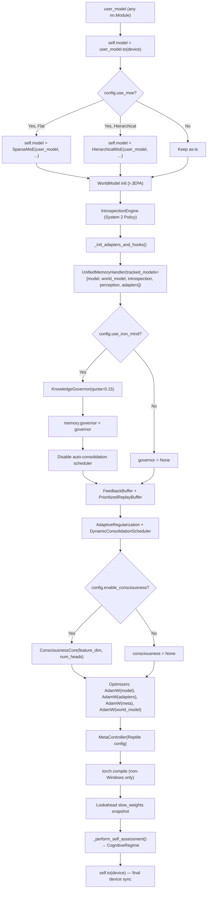
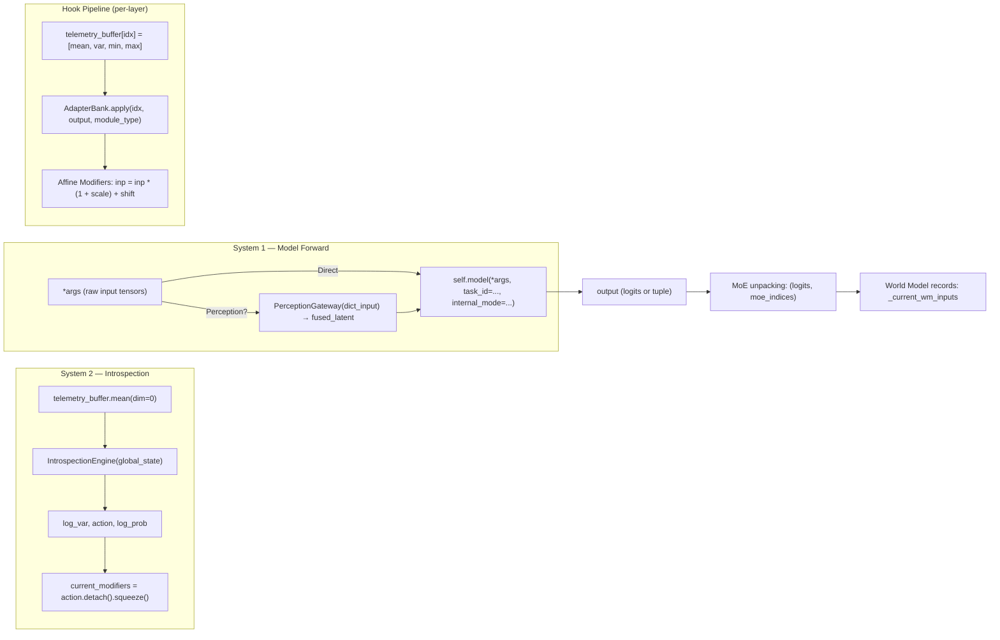
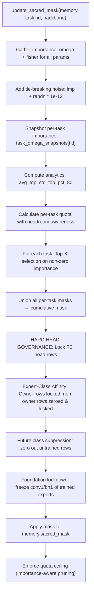
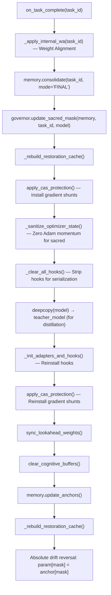

# MANDATE.md — Airborne-Antara Architectural Bible
> **Version:** V9.4 "Eternal Edition" (Sentient)  
> **Last Audit:** 2026-07-14  
> **Purpose:** Single source of truth for **every** agent, human, or process touching this codebase.  
> **Rule:** Read this document **in full** before writing a single line of code.

---

## Table of Contents

1. [Mission Statement](#1-mission-statement)
2. [Package Map](#2-package-map)
3. [Initialization Flow](#3-initialization-flow)
4. [Forward Pass — Tensor Path](#4-forward-pass--tensor-path)
5. [Training Step — Orchestration](#5-training-step--orchestration)
6. [Memory System — Unified Handler](#6-memory-system--unified-handler)
7. [Iron Mind — Knowledge Governance](#7-iron-mind--knowledge-governance)
8. [Mixture of Experts (MoE)](#8-mixture-of-experts-moe)
9. [Consciousness System](#9-consciousness-system)
10. [Meta-Controller & Reptile](#10-meta-controller--reptile)
11. [World Model (I-JEPA)](#11-world-model-i-jepa)
12. [Perception Gateway](#12-perception-gateway)
13. [Adapters](#13-adapters)
14. [All Formulas & Penalties](#14-all-formulas--penalties)
15. [Task Lifecycle — on_task_complete](#15-task-lifecycle--on_task_complete)
16. [Evaluation & Inference](#16-evaluation--inference)
17. [Test Suite — NeurIPS Gauntlet](#17-test-suite--neurips-gauntlet)
18. [Known Constraints & Platform Issues](#18-known-constraints--platform-issues)
19. [Audit Findings](#19-audit-findings)
20. [Agent Mandate Rules](#20-agent-mandate-rules)

---

## 1. Mission Statement

Airborne-Antara (`airborne_antara`) is a **universal PyTorch wrapper** that transforms any neural network into an adaptive, continual-learning, self-aware cognitive system. The core promise:

> **Wrap any `nn.Module` → Train on task sequences → Achieve zero catastrophic forgetting.**

The system targets **Class-Incremental Learning (Class-IL)** on benchmarks like Split-CIFAR-100 (10 tasks × 10 classes), measured by:

| Metric | Formula | NeurIPS Target |
|--------|---------|----------------|
| **ACC** | `mean(R[T-1, :])` — average accuracy after all tasks | ≥ 0.50 |
| **BWT** | `Σ(R[T-1,j] − R[j,j]) / (T−1)` — backward transfer | ≥ −0.05 |
| **FWT** | `Σ(R[j-1,j] − baseline[j]) / (T−1)` — forward transfer | ≥ 0.00 |

Where `R[i,j]` = accuracy on task `j` after training on task `i`.

---

## 2. Package Map

```
airborne_antara/
├── __init__.py          # Exports AdaptiveFramework, AdaptiveFrameworkConfig
├── core.py              # AdaptiveFramework (2541 lines) — The Orchestrator
├── memory.py            # UnifiedMemoryHandler, PrioritizedReplayBuffer (1334 lines)
├── governance.py        # KnowledgeGovernor — Iron Mind Quota (407 lines)
├── moe.py               # SparseMoE, HierarchicalMoE, GatingNetwork (483 lines)
├── consciousness_v2.py  # EnhancedConsciousnessCore, Global Workspace (751 lines)
├── meta_controller.py   # MetaController, ReptileOptimizer (sacred-aware)
├── world_model.py       # WorldModel (I-JEPA predictor)
├── perception.py        # PerceptionGateway (Vision/Audio/Text fusion)
└── adapters.py          # AdapterBank (FiLM / Bottleneck adapters)
```

```
NeurIPS/ (Test Suite)
├── Phase_I_Curriculum/  # SplitCIFAR100 data loader + deterministic splits
├── Phase_II_Baselines/  # Baseline runs for comparison
├── Phase_III_Metrics/   # MetricsEngine (ACC/BWT/FWT calculation + heatmaps)
└── Phase_IV_Ablation/   # Ablation study configurations
```

---

## 3. Initialization Flow

**Entry point:** `AdaptiveFramework.__init__(user_model, config, device)`



### Cognitive Regime Detection (V9.4)

| Regime | Condition | Effect |
|--------|-----------|--------|
| `SCRATCH` | Random weights, no memory | Meta LR × 1.5, low novelty threshold |
| `TRANSFER` | Pretrained weights, no memory | SI λ × 1.5 |
| `CONTINUOUS` | Pretrained + existing memory | SI λ × 2.0, high novelty threshold |
| `GHOST` | Random weights + existing memory | SI λ × 3.0 |

Detection heuristic: `abs(weight_mean) > 0.05 or weight_std > 0.2` → pretrained.

---

## 4. Forward Pass — Tensor Path

**Signature:** `forward(*args, **kwargs) → (output, log_var, affine_modifiers, moe_indices)`



### Hook Pipeline Details

Every `nn.Linear`, `nn.Conv2d`, `nn.Conv1d`, `nn.LSTM`, `nn.GRU`, `nn.MultiheadAttention` gets a forward hook via `_generate_fast_hook(idx, type)`:

1. **Telemetry:** `telemetry_buffer[idx] = [output.mean(), output.var(), output.min(), output.max()]`
2. **Adapter:** `adapter_bank.apply(idx, output)` — FiLM modulation (`γ * x + β`)
3. **Sentient Modifier:** If `current_modifiers` is set, apply affine with warmup:
   - `warmup_scale = min(1.0, steps_since_task_start / 1000.0)`
   - `scale = 1.0 + (mods[0].clamp(-0.4, 0.4) * warmup_scale)`
   - `shift = mods[1].clamp(-1.0, 1.0) * warmup_scale`
   - `output = output * scale + shift`

### MoE Routing (Training vs. Eval)

| Phase | Routing Strategy |
|-------|-----------------|
| **Training** | **Forced deterministic:** `target_expert = task_id % num_experts`. Per-sample routing if `target_data` contains class labels. Gate is still called for **supervised gate training** (cross-entropy on gate logits vs. target expert). |
| **Evaluation** | **Learned gate:** `top_k=1` forced. Gate selects the single best expert per sample. No task_id oracle. |

---

## 5. Training Step — Orchestration

**Signature:** `train_step(*model_inputs, target_data, task_id, enable_dream, meta_step, record_stats) → dict`

```mermaid
flowchart TD
    A["train_step() called"] --> B["Task boundary detection"]
    B -->|"New task?"| C["_sanitize_optimizer_state() + flush telemetry"]
    B -->|"Same task"| D["_steps_since_task_start += 1"]
    C --> E["Zero all optimizers"]
    D --> E
    E --> F["_lock_sacred_bn()"]
    F --> G["param_before = memory.before_step_snapshot()"]
    G --> H["autocast forward pass"]
    H --> I["Consciousness.observe(y_true, y_pred, features)"]
    I --> J["Compute base loss (CE or MSE)"]
    J --> K["memory.compute_penalty() → reg_loss"]
    K --> L["World Model loss (temporal prediction)"]
    L --> M["MoE aux_loss (Gini + variance)"]
    M --> N["Surgical weight decay (non-sacred only)"]
    N --> O["total_loss = loss + reg_loss + aux_loss + wm_loss*0.5 + surgical_wd"]
    O --> P["REINFORCE meta_loss (advantage-based)"]
    P --> Q["final_loss = total_loss + meta_loss"]
    Q --> R["scaler.scale(final_loss).backward()"]
    R --> S["Gradient noise annealing (task transitions, first 100 steps)"]
    S --> T["LR gating by surprise (world model loss)"]
    T --> U["Gradient centralization"]
    U --> V["clip_grad_norm_(model, 1.0)"]
    V --> W["scaler.step(all optimizers)"]
    W --> X["memory.accumulate_path(param_before)"]
    X --> Y["_lookahead_step() (sacred-aware)"]
    Y --> Z["_apply_sacred_restoration()"]
    Z --> AA["finally: _clear_all_internal_caches() + zero_grad"]
    AA --> AB["MetaController.adapt() (Reptile + LR schedule)"]
    AB --> AC["learn_from_buffer() (dreaming)"]
    AC --> AD["Auto-consolidation check"]
    AD --> AE["feedback_buffer.add(snapshot)"]
    AE --> AF["Return metrics dict"]
```



### Loss Components Breakdown

| Component | Formula | Weight | Clamp |
|-----------|---------|--------|-------|
| **Base loss** | `F.cross_entropy(logits, labels, label_smoothing=surprise*0.05)` | 1.0 | — |
| **SI penalty** | `Σ(ω * (θ − θ_anchor)²) / N_params` | `si_lambda * mode_base` | max 10,000 |
| **EWC penalty** | `Σ(F * (θ − θ_anchor)²) / N_params` | `ewc_lambda * mode_base` | max 10,000 |
| **MoE aux** | `(var(importance)/mean²) * 0.5 + (1 − Gini) * 0.5` | 0.1 | nan→0 |
| **Routing CE** | `F.cross_entropy(gate_logits, target_expert)` | 1.0 | — |
| **World Model** | `MSE(z_pred, z_actual)` | 0.5 | — |
| **Surgical WD** | `Σ(θ_nonsacred² * wd_rate) / N_total` | 1.0 | — |
| **Meta (REINFORCE)** | `−mean(log_probs) * advantage` | 1.0 | — |

### Mode-Aware Lambda Scaling

```python
mode_base = {
    'BOOTSTRAP': 0.5,
    'PANIC':     0.5,
    'SURVIVAL':  0.8,
    'NOVELTY':   1.0,
    'NORMAL':    1.0
}
# V31.8 WARRIOR MODE: No zero-penalty windows ever.
```

---

## 6. Memory System — Unified Handler

**File:** [memory.py](file:///c:/Users/surya/.inUse/ultorg/airborne-code/Antara/Mirror_mind/airborne_antara/memory.py)

### 6.1 Architecture

```
UnifiedMemoryHandler
├── models: List[nn.Module]     # All tracked modules (model, world_model, introspection, perception, adapters)
├── method: 'hybrid'            # 'ewc', 'si', or 'hybrid' (both)
├── omega: Dict[str, Tensor]    # SI importance (path integral accumulator)
├── anchor: Dict[str, Tensor]   # Parameter snapshot at last consolidation
├── fisher_dict: Dict[str, T]   # EWC Fisher Information diagonal
├── opt_param_dict: Dict[str, T]# EWC optimal parameter cache
├── sacred_mask: Dict[str, Bool]# Iron Mind binary mask (from Governor)
├── omega_accum: Dict[str, T]   # Running SI accumulator (pre-normalize)
├── projector: OGDProjector     # Orthogonal Gradient Descent (optional)
├── holographic_vault: HolVault # Deep parameter archive (optional)
└── governor: KnowledgeGovernor # Reference to quota enforcer
```

### 6.2 Synaptic Intelligence (SI) — Path Integral

**Key formulas:**

```
# Before step:
param_before[name] = θ.clone()

# After step (accumulate_path):
Δθ = θ − θ_before
ω_accum[name] += -grad * Δθ           # Approximate path integral

# Consolidation:
ω[name] = max(0, ω_accum[name]) / (Δθ_total² + ξ)    # Normalize
anchor[name] = θ.clone()               # Snapshot current weights
ω_accum[name] = 0                      # Reset accumulator

# Penalty:
L_SI = (si_lambda * mode_base / N_params) * Σ(ω * (θ − anchor)²)
```

### 6.3 Elastic Weight Consolidation (EWC)

```
# Consolidation (compute Fisher):
F[name] = E[grad²]    # Diagonal Fisher approximation
# Computed by running N batches from buffer, accumulating grad²

# Penalty:
L_EWC = (ewc_lambda * mode_base / N_params) * Σ(F * (θ − θ_optimal)²)
```

### 6.4 Hybrid Mode

Both SI and EWC penalties are summed. Fisher and Omega contribute to the same sacred mask calculation.

### 6.5 Consolidation Triggers

| Criterion | Condition | Blocked Modes |
|-----------|-----------|---------------|
| `time` | `steps_since_last > max_interval` | BOOTSTRAP, PANIC, SURVIVAL |
| `surprise` | `z_score > 2.0 AND steps > min_interval AND mode == NOVELTY` | Same |
| `hybrid` | Either condition met | Same |

**Under Iron Mind:** Auto-consolidation is disabled. Only `on_task_complete()` triggers consolidation.

---

## 7. Iron Mind — Knowledge Governance

**File:** [governance.py](file:///c:/Users/surya/.inUse/ultorg/airborne-code/Antara/Mirror_mind/airborne_antara/governance.py)

### 7.1 The Quota System

The `KnowledgeGovernor` enforces a hard mathematical ceiling on how many parameters can be "sacred" (frozen).

**Default quota:** 15% (`iron_mind_quota = 0.15`)

### 7.2 Sacred Mask Construction



### 7.3 Per-Task Quota Formula

```python
BASE_TASK_TARGET = (quota / num_tasks_total) * headroom_multiplier
# headroom_multiplier = 2.5 if saturation < 40% of quota, else 1.2

dampening = max(0.4, 1.0 - (saturation / quota))
density_factor = max(0.8, min(1.5, 1.0 + log2(pct_80 / 0.001) * 0.1))
task_quota = clamp(BASE_TASK_TARGET * density_factor * dampening, 0.01, 0.25)
```

### 7.4 Expert-Class Affinity (FC Head)

```python
for each expert e, for each completed task t:
    owner_expert = t % num_experts
    rows = [t * cpt : (t+1) * cpt]
    if e == owner_expert:
        lock rows (preserve trained weights)
    else:
        ZERO rows + lock (prevent random logit interference)

# Future classes (untrained):
fc.weight[future_start:, :] = 0.0   # NOT locked — available for future tasks
```

### 7.5 Protection Enforcement Stack

After masks are computed, protection is enforced via 3 mechanisms:

| Layer | Mechanism | What it protects | When |
|-------|-----------|------------------|------|
| **CAS Hooks** | `param.register_hook(grad_shunt)` | Gradients → 0 for sacred params | Every backward pass |
| **Sacred Restoration** | `param.data[mask] = anchor[mask]` | Weight values snapped to anchor | After every optimizer.step() |
| **Optimizer Sanitization** | `state['exp_avg'][mask] = 0` | Adam momentum/variance zeroed | On task transition |

---

## 8. Mixture of Experts (MoE)

**File:** [moe.py](file:///c:/Users/surya/.inUse/ultorg/airborne-code/Antara/Mirror_mind/airborne_antara/moe.py)

### 8.1 SparseMoE Architecture

```
SparseMoE
├── experts: ModuleList[ExpertBlock × N]    # N = 10 (default)
│   └── ExpertBlock.model = deepcopy(user_model)
├── gate: GatingNetwork
│   ├── feature_extractor: TrainableFeatureExtractor (CNN: 3→32→64→128→flatten)
│   └── gate: Linear(512, N)
└── expert_usage: Buffer[N] (usage counter)
```

### 8.2 Gating Network

```python
# Feature extraction:
x_img = x.view(B, 3, 32, 32)   # For CIFAR
x_flat = CNN(x_img)              # → [B, 512]

# Routing:
logits = gate(x_flat) / temperature
top_k_logits, top_k_indices = topk(logits, k)
weights = softmax(top_k_logits)

# Aux loss (load balancing):
importance = scatter(weights, indices)
var_loss = var(importance) / mean(importance)²
gini_loss = 1 - Σ(probs²)
aux_loss = 0.5 * var_loss + 0.5 * (1 - gini_loss)
```

### 8.3 Expert Dropout (Training Only)

```python
# 10% chance: drop a random expert
if training and rand() < 0.1:
    weights[indices == drop_idx] = 0
    weights /= weights.sum(dim=1, keepdim=True)  # Re-normalize
```

### 8.4 HierarchicalMoE

```
HierarchicalMoE
├── domain_router: GatingNetwork(input_dim, num_domains, top_k=1)
└── domains: ModuleList[SparseMoE × num_domains]
    └── Each domain has its own set of experts + gate
```

Routing: `global_expert = domain_idx * experts_per_domain + local_expert_idx`

---

## 9. Consciousness System

**File:** [consciousness_v2.py](file:///c:/Users/surya/.inUse/ultorg/airborne-code/Antara/Mirror_mind/airborne_antara/consciousness_v2.py)

### 9.1 Components

| Component | Role |
|-----------|------|
| `EmotionalSystem` | Maps (confidence, uncertainty, novelty, loss) → emotional state (CONFIDENT/ANXIOUS/CURIOUS/etc.) |
| `MetaCognition` | Tracks learning rate, plateau detection, trend analysis |
| `EpisodicMemory` | Stores (x, error, surprise, features, task_difficulty) episodes |
| `SelfModel` | Maintains domain competencies, readiness assessment |
| `Personality` | Exploration/exploitation tendency, risk tolerance |
| `AdaptiveAwareness` | Consciousness level (0.0=autopilot ↔ 1.0=maximum alertness) |
| `RecursiveGlobalWorkspace` | Multi-head attention "thinking" loop (System 2) |

### 9.2 observe() Flow

```python
def observe(x, y_true, y_pred, task_id, features, internal_mode):
    # 1. Error & Surprise
    error = cross_entropy(y_pred, y_true)  # or abs(y_pred - y_true) for regression
    surprise = z_score(error)              # (error - running_mean) / running_std

    # 2. Global Workspace (System 2 thinking)
    if features and not internal_mode:
        thinking_steps = 3 if uncertain else (2 if medium else 1)
        workspace_out, trace = global_workspace(features, thinking_steps)

    # 3. MetaCognition reflection
    # 4. Emotional state computation
    # 5. Episodic memory storage
    # 6. Return metrics dict:
    #    {loss, confidence, uncertainty, surprise, novelty, emotion, confusion,
    #     importance, learning_rate_multiplier, consciousness_state}
```

### 9.3 Surprise Formula (Z-Score)

```python
z_score = (current_error - error_mean) / error_std
# error_mean uses EWMA: α=0.99
# error_std = sqrt(ewma_variance), floor=1e-4
```

### 9.4 Importance Score

```python
importance = 1.0 + surprise + (1 - confidence)
```

---

## 10. Meta-Controller & Reptile

**File:** [meta_controller.py](file:///c:/Users/surya/.inUse/ultorg/airborne-code/Antara/Mirror_mind/airborne_antara/meta_controller.py)

### 10.1 Reptile Optimizer

```python
# Every reptile_update_interval steps:
# 1. Save current weights: θ_before
# 2. Run K inner steps on current task
# 3. Compute: θ_after = θ_current
# 4. Update: θ = θ_before + reptile_lr * (θ_after - θ_before)

# CRITICAL: Sacred mask awareness
# For sacred parameters: θ[mask] = anchor[mask]  # Never modify sacred
```

### 10.2 Adaptive Mode Detection

```python
modes = {
    'BOOTSTRAP': z_score < -2.0,           # Loss dropping fast
    'PANIC':     z_score > survival_threshold,  # Loss exploding
    'SURVIVAL':  z_score > novelty_threshold * 2,
    'NOVELTY':   z_score > novelty_threshold,
    'NORMAL':    otherwise
}
```

---

## 11. World Model (I-JEPA)

**File:** [world_model.py](file:///c:/Users/surya/.inUse/ultorg/airborne-code/Antara/Mirror_mind/airborne_antara/world_model.py)

```python
class WorldModel:
    # Predicts next latent state from current latent + action
    # z_pred = predictor(z_current, action_context)
    # surprise = MSE(z_pred, z_actual)
    # Used for:
    #   1. LR gating: lr_gate = clamp(surprise / 4.0, 0.2, 1.0)
    #   2. Cognitive inference foresight
    #   3. Loss component: wm_loss * 0.5
```

---

## 12. Perception Gateway

**File:** [perception.py](file:///c:/Users/surya/.inUse/ultorg/airborne-code/Antara/Mirror_mind/airborne_antara/perception.py)

Handles multi-modal input (vision, audio, text) → fused latent.  
**Currently disabled** in NeurIPS config (`enable_perception: False`).

---

## 13. Adapters

**File:** [adapters.py](file:///c:/Users/surya/.inUse/ultorg/airborne-code/Antara/Mirror_mind/airborne_antara/adapters.py)

```python
class AdapterBank:
    # FiLM adapter: output = γ * x + β
    # Applied per-layer via forward hooks
    # Separate optimizer: AdamW(adapter_params, lr=weight_adaptation_lr)
    # Tracked by UnifiedMemoryHandler for Iron Mind protection
```

---

## 14. All Formulas & Penalties

### 14.1 Synaptic Intelligence (SI)

```
ω_accum += -grad(L) · Δθ
ω = max(0, ω_accum) / (Δθ² + ξ)           [ξ = 1e-3]
L_SI = (si_lambda / N) · Σ ω · (θ − θ*)²   [si_lambda = 800.0]
```

### 14.2 Elastic Weight Consolidation (EWC)

```
F_i = E[(∂L/∂θ_i)²]                       [Diagonal Fisher]
L_EWC = (ewc_lambda / N) · Σ F · (θ − θ*)² [ewc_lambda = 600.0]
```

### 14.3 Combined Regularization Penalty

```
L_reg = L_SI · (si_lambda · base) + L_EWC · (ewc_lambda · base)
base ∈ {BOOTSTRAP: 0.5, PANIC: 0.5, SURVIVAL: 0.8, NOVELTY: 1.0, NORMAL: 1.0}
L_reg = clamp(nan_to_num(L_reg), max=10000)
```

### 14.4 Gini Expert Diversity

```
P_i = Σ_batch(weight_i) / Σ_all(weights)
Gini = 1 − Σ P_i²
aux_loss = 0.5 · var(importance)/mean² + 0.5 · (1 − Gini)
```

### 14.5 Gradient Centralization

```
grad_centralized = grad − mean(grad, dim=1..D, keepdim=True)
# Applied only to weight tensors (dim > 1), not biases
```

### 14.6 Lookahead Optimization

```
Every K=5 steps:
    slow = slow + α · (fast − slow)     [α = 0.5]
    # Sacred params: slow[mask] = anchor[mask]
    fast.copy_(slow)
```

### 14.7 Gradient Noise Annealing

```
# First 100 steps of Task > 0:
noise = randn_like(grad) · grad.std() · 0.01 · (1 − step/100)
grad += noise
```

### 14.8 LR Gating by Surprise

```
lr_gate = clamp(wm_loss / 4.0, 0.2, 1.0)
grad *= lr_gate
```

### 14.9 Label Smoothing (Consciousness-Driven)

```
smoothing = clamp(surprise * 0.05, 0.0, 0.2)
loss = cross_entropy(logits, labels, label_smoothing=smoothing)
```

### 14.10 Surgical Weight Decay

```
L_wd = (1/N_total) · Σ (θ_nonsacred)² · wd_rate    [wd_rate = 1e-6]
```

### 14.11 REINFORCE Meta-Policy

```
reward = loss_prev − loss_current
baseline = 0.9 · baseline + 0.1 · reward
advantage = reward − baseline
L_meta = −mean(log_probs) · advantage
```

### 14.12 Weight Alignment (WA)

```
# After task_id > 0, before anchoring:
γ = mean_norm(prev_classes) / mean_norm(current_classes)
fc.weight[current_rows] *= γ
fc.bias[current_rows] *= γ
```

### 14.13 Dreaming (Replay) Loss

```
L_dream = L_CE + L_reg + 0.5 · L_distill + 1.0 · L_consistency
# L_distill = KL(student || teacher) · T²    [T=2.0]
# L_consistency = MSE(current_latent, stored_latent)
```

---

## 15. Task Lifecycle — on_task_complete

**Method:** `on_task_complete(task_id)` — Called at task boundaries.



---

## 16. Evaluation & Inference

### 16.1 Standard Inference

**Method:** `inference_step(*inputs, task_id=None)` — Note: **task_id is always None** in Class-IL.

```python
# V31.7: No oracle leakage — task_id=None during eval
outputs = forward(*inputs, task_id=None)
prediction = clamp(logits, -10.0, 10.0)
# No logit slicing — full head used (Class-IL)
```

### 16.2 Cognitive Inference (System 2)

```python
# 1. Fast System 1 pass
# 2. Check uncertainty > threshold
# 3. If confused:
#    a. Query World Model for foresight
#    b. Query Graph Memory for similar experiences
#    c. Ensemble: 0.7 * prediction + 0.3 * memory_mean
```

---

## 17. Test Suite — NeurIPS Gauntlet

### 17.1 Data

```python
# SplitCIFAR100: 10 tasks × 10 classes
# Deterministic class order: [0,1,...,99]
# Tasks: [[0-9], [10-19], ..., [90-99]]
# Normalization: (0.5071, 0.4867, 0.4408), (0.2675, 0.2565, 0.2761)
# 90/10 train/val split, deterministic per-task seeding
```

### 17.2 MetricsEngine

```python
# R[i,j] = accuracy on task j after training up to task i
# ACC = mean(R[T-1, :])           # Final average accuracy
# BWT = Σ(R[T-1,j] - R[j,j]) / (T-1)   # Backward transfer
# FWT = Σ(R[j-1,j] - 0.10) / (T-1)     # Forward transfer (baseline=10%)
```

---

## 18. Known Constraints & Platform Issues

| Issue | Impact | Mitigation |
|-------|--------|------------|
| `torch.compile` crashes on Windows | No JIT compilation | Skipped via `platform.system() != 'Windows'` |
| `deepcopy` fails with hooks attached | Teacher snapshot crashes | `_clear_all_hooks()` → deepcopy → reinstall |
| AMP scaler on CPU | Scaler is no-op | `enabled=use_amp and device == 'cuda'` |
| Sacred mask device mismatch | `RuntimeError` in restoration | Explicit `.to(param.device)` everywhere |
| Consciousness disabled for NeurIPS | System 2 not contributing to metrics | `enable_consciousness: False` in default config |
| Hook duplication on expansion | Performance degradation | `_antara_hook_installed` flag check |

---

## 19. Audit Findings

### 🔴 Critical Issues (All Resolved)

| ID | Finding | Location | Status |
|----|---------|----------|--------|
| **A-01** | `dream_batch_size=0` disables dreaming entirely. | [core.py:73](file:///c:/Users/surya/.inUse/ultorg/airborne-code/Antara/Mirror_mind/airborne_antara/core.py#L73) | **RESOLVED** — Default `dream_batch_size` set to `32` to enable replay. |
| **A-03** | `_steps_since_task_start` double counts steps. | [core.py:1326](file:///c:/Users/surya/.inUse/ultorg/airborne-code/Antara/Mirror_mind/airborne_antara/core.py#L1326), [core.py:1577](file:///c:/Users/surya/.inUse/ultorg/airborne-code/Antara/Mirror_mind/airborne_antara/core.py#L1577) | **RESOLVED** — Duplicate increment removed from the finally block. Garbage collection is now optimized. |
| **A-04** | `PerformanceMonitor.adapt_weights()` was dead code because modifiers were cleared in `finally`. | [core.py:1557](file:///c:/Users/surya/.inUse/ultorg/airborne-code/Antara/Mirror_mind/airborne_antara/core.py#L1557), [core.py:1588](file:///c:/Users/surya/.inUse/ultorg/airborne-code/Antara/Mirror_mind/airborne_antara/core.py#L1588) | **RESOLVED** — Call moved inside `try` block before modifiers are cleared to `None`. |
| **A-05** | `learn_from_buffer` calls mismatched `accumulate_importance` instead of `accumulate_path`. | [core.py:1880](file:///c:/Users/surya/.inUse/ultorg/airborne-code/Antara/Mirror_mind/airborne_antara/core.py#L1880) | **RESOLVED** — Mismatched calls changed to `accumulate_path`. |
| **A-06** | `PrioritizedReplayBuffer` pre-allocates with `None` values causing invalid samples. | [memory.py:1181](file:///c:/Users/surya/.inUse/ultorg/airborne-code/Antara/Mirror_mind/airborne_antara/memory.py#L1181) | **RESOLVED** — Buffer initialized as an empty list to dynamically size the sampling range. |
| **A-08** | Episodic memory had orphaned task consolidation code referencing undefined `task_id`. | [core.py:2008-2024](file:///c:/Users/surya/.inUse/ultorg/airborne-code/Antara/Mirror_mind/airborne_antara/core.py#L2008-L2024) | **RESOLVED** — Removed orphaned mask update code from `learn_from_episodic_memory`. |
| **A-09** | Teacher distillation in `learn_from_buffer` passes raw `batch_args` list causing crash. | [core.py:1847](file:///c:/Users/surya/.inUse/ultorg/airborne-code/Antara/Mirror_mind/airborne_antara/core.py#L1847) | **RESOLVED** — Arguments are correctly unpacked as `*batch_args` and tuple outputs are handled. |
| **A-10** | Inactive world model caused `lr_gate=0.2` (80% gradient throttling). | [core.py:1500-1506](file:///c:/Users/surya/.inUse/ultorg/airborne-code/Antara/Mirror_mind/airborne_antara/core.py#L1500-L1506) | **RESOLVED** — LR gating by surprise only applied when world model is active with non-zero loss. |
| **A-11** | Broken phantom imports in `__init__.py` (`self_awareness_v2`, `integration_guide`). | [__init__.py](file:///c:/Users/surya/.inUse/ultorg/airborne-code/Antara/Mirror_mind/airborne_antara/__init__.py) | **RESOLVED** — Cleaned up exports and added missing core components (`SparseMoE`, `WorldModel`, etc.). |
| **A-12** | BatchNorm covariate shift across sequential tasks without domain tracking. | [core.py:858-875](file:///c:/Users/surya/.inUse/ultorg/airborne-code/Antara/Mirror_mind/airborne_antara/core.py#L858-L875), [core.py:2085-2095](file:///c:/Users/surya/.inUse/ultorg/airborne-code/Antara/Mirror_mind/airborne_antara/core.py#L2085-L2095) | **RESOLVED** — Added TaskBN statistics snapshotting (`_task_bn_stats`) and domain restoration during evaluation. |
| **A-13** | Universal Head Governance was restricted to `fc` layer names only. | [governance.py:35-38](file:///c:/Users/surya/.inUse/ultorg/airborne-code/Antara/Mirror_mind/airborne_antara/governance.py#L35-L38), [governance.py:173](file:///c:/Users/surya/.inUse/ultorg/airborne-code/Antara/Mirror_mind/airborne_antara/governance.py#L173), [core.py:2451](file:///c:/Users/surya/.inUse/ultorg/airborne-code/Antara/Mirror_mind/airborne_antara/core.py#L2451) | **RESOLVED** — Expanded head detection to `fc`, `classifier`, `head`, and `out_proj` for all PyTorch/HuggingFace architectures. |
| **A-14** | `AdaptiveFramework.to()` was fragile when called with dtype (`to(torch.float16)`). | [core.py:675-688](file:///c:/Users/surya/.inUse/ultorg/airborne-code/Antara/Mirror_mind/airborne_antara/core.py#L675-L688) | **RESOLVED** — Added type-checking for device vs dtype in `to()` method. |
| **A-15** | `_compute_surgical_weight_decay` only decayed `m0_` (single model). | [core.py:2404-2430](file:///c:/Users/surya/.inUse/ultorg/airborne-code/Antara/Mirror_mind/airborne_antara/core.py#L2404-L2430) | **RESOLVED** — Iterates over all models in `memory.models` for universal weight decay. |
| **A-16** | `cons_proj` dynamic module in `GatingNetwork` was not registered as PyTorch submodule. | [moe.py:155-163](file:///c:/Users/surya/.inUse/ultorg/airborne-code/Antara/Mirror_mind/airborne_antara/moe.py#L155-L163) | **RESOLVED** — Registered via `self.add_module('cons_proj', self.cons_proj)`. |

### 🟡 Design Observations

| ID | Finding | Location | Note |
|----|---------|----------|------|
| **A-02** | `use_prioritized_replay=False` in default config vs `True` in presets. | [core.py:105](file:///c:/Users/surya/.inUse/ultorg/airborne-code/Antara/Mirror_mind/airborne_antara/core.py#L105) | Minor config mismatch. |
| **A-07** | Inference logit clamp at `[-10, 10]` but no clamp during training. | [core.py:2111](file:///c:/Users/surya/.inUse/ultorg/airborne-code/Antara/Mirror_mind/airborne_antara/core.py#L2111) | Could cause minor mismatch at extreme logit boundaries. |

### 🟢 Correctly Implemented

| Feature | Assessment |
|---------|------------|
| SI path integral accumulation | ✅ Correct: before/after snapshot + gradient-weighted path |
| EWC Fisher computation | ✅ Correct: diagonal approximation via grad² |
| Sacred mask construction | ✅ Correct: union of per-task Top-K masks |
| CAS gradient shunts | ✅ Correct: `grad * where(mask, 0.0, 1.0)` |
| Sacred restoration post-optimizer | ✅ Correct: `param[mask] = anchor[mask]` |
| MoE forced routing during training | ✅ Correct: deterministic expert assignment |
| MoE learned routing during eval | ✅ Correct: top_k=1, no oracle |
| Gate supervised training | ✅ Correct: CE(gate_logits, target_expert) |
| Expert-class head zeroing | ✅ Correct: non-owners get 0.0 and locked |
| Weight Alignment (WA) | ✅ Correct: norm balancing across task heads |
| Lookahead sacred-awareness | ✅ Correct: anchor used for sacred coordinates |
| Optimizer sanitization | ✅ Correct: momentum/variance zeroed for sacred |
| Deterministic data splits | ✅ Correct: task-aware seeding with Generator |

---

## 20. Agent Mandate Rules

> [!CAUTION]
> **Every agent MUST read this document before modifying any file in `airborne_antara/`.**

### Rule 1: Understand Before Changing
Before modifying any module, trace the **full data flow** through this document. A change in `memory.py` can cascade through `governance.py` → `core.py` → `moe.py`.

### Rule 2: Never Break Sacred Protection
The 3-layer protection stack (CAS hooks → Sacred Restoration → Optimizer Sanitization) is **non-negotiable**. Any change that introduces a path where sacred weights can be modified will destroy all prior task knowledge.

### Rule 3: Graph Isolation is Sacred
Every training step MUST be graph-isolated. Cross-step tensor references cause `RuntimeError: Trying to backward through the graph a second time`. The `_clear_all_internal_caches()` in the `finally` block exists for this reason.

### Rule 4: Device Affinity
All tensor operations must explicitly handle device placement. The codebase supports CPU and CUDA. Every `.to(device)` call exists to prevent `RuntimeError: expected all tensors to be on the same device`.

### Rule 5: Test with the NeurIPS Gauntlet
After any change:
1. Run the Phase I curriculum (SplitCIFAR100, 10 tasks)
2. Verify BWT ≥ -0.05 (zero forgetting)
3. Verify ACC ≥ 0.50 (competitive accuracy)

### Rule 6: Update This Document
If you change any formula, data flow, or architectural component, update the corresponding section of Mandate.md **in the same commit**.

---

*End of Mandate. This document is the law.*
