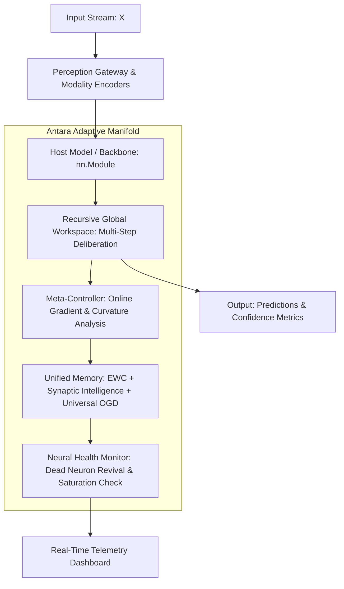

<div align="center">

# ⚡ AIRBORNE-ANTARA
### Production Meta-Learning & Continual Optimization Framework for PyTorch

[](https://github.com/AirBorneAI/Airborne-Antara/actions/workflows/ci.yml)
[](https://github.com/AirBorneAI/Airborne-Antara/actions/workflows/codeql.yml)
[](https://python.org)
[](https://pytorch.org)
[](LICENSE)
[](https://doi.org/10.5281/zenodo.17839490)

<br/>

```
  ┌────────────────────────────────────────────────────────────────────────────┐
  │                                                                            │
  │     █████╗ ███╗   ██╗████████╗ █████╗ ██████╗  █████╗                      │
  │    ██╔══██╗████╗  ██║╚══██╔══╝██╔══██╗██╔══██╗██╔══██╗                     │
  │    ███████║██╔██╗ ██║   ██║   ███████║██████╔╝███████║  AIRBORNE-ANTARA    │
  │    ██╔══██║██║╚██╗██║   ██║   ██╔══██║██╔══██╗██╔══██║  v0.2.0             │
  │    ██║  ██║██║ ╚████║   ██║   ██║  ██║██║  ██║██║  ██║                     │
  │    ╚═╝  ╚═╝╚═╝  ╚═══╝   ╚═╝   ╚═╝  ╚═╝╚═╝  ╚═╝╚═╝  ╚═╝                     │
  │                                                                            │
  └────────────────────────────────────────────────────────────────────────────┘
```

<p align="center">
  
</p>

**AirBorne-Antara** is a modular PyTorch framework that turns standard deep learning models into **continually self-improving systems**. It provides parameter-protective memory, adaptive meta-optimization, sparse MoE routing, and runtime neural health telemetry without requiring model rewrites.

[Quickstart](#-quickstart) • [Architecture](#-architecture) • [Key Capabilities](#-key-capabilities) • [Presets](#-production-presets) • [CLI Telemetry](#-cli--telemetry) • [Documentation](#-documentation)

</div>

---

## 💡 Why Airborne-Antara?

Deploying deep learning models to dynamic production environments faces two fundamental bottlenecks:

1. **Catastrophic Forgetting:** Fine-tuning on new data destroys performance on previously learned distributions.
2. **Static Hyperparameters:** Fixed learning rates and standard SGD/Adam fail to adapt to distribution shift, gradient saturation, and non-stationary loss landscapes.

**Antara wraps any existing `nn.Module` with a non-invasive adaptation layer** that continually consolidates critical weights, balances learning dynamics in real time, and monitors neural health in production.

---

## 🏗️ Architecture



---

## ⚡ Key Capabilities

### 1. Unified Continual Memory (Zero Catastrophic Forgetting)
Combines **Elastic Weight Consolidation (EWC)**, **Synaptic Intelligence (SI)**, and **Orthogonal Gradient Descent (OGD)** into a unified parameter importance manifold.
- Computes parameter Fisher information and path integrals online.
- Projects new task gradients orthogonally to historical subspace.
- Extends protection across linear, convolutional, and attention layers via **Universal Tensor Projection**.

### 2. Adaptive Online Meta-Controller
Dynamically modulates optimization parameters during training and inference:
- Real-time learning rate modulation based on loss surface curvature.
- Dynamic gradient centralization and gradient norm clipping.
- Regime-aware loss weighting (Exploration vs. Exploitation).

### 3. Sparse Mixture-of-Experts (MoE) Substrate
Drop-in routing layer with load-balanced expert dispatching:
- Dynamically routes inputs to top-$k$ expert sub-networks.
- MoE-aware gradient isolation prevents expert collapse.
- Automatic routing entropy optimization.

### 4. Recursive Global Workspace (Multi-Step Reasoning)
Enables multi-step deliberative passes over complex samples:
- Dynamic internal reasoning depth based on sample entropy.
- Step-by-step thought trace generation with confidence scoring.
- Early exit mechanism for low-entropy inputs to minimize inference latency.

### 5. Production Invariant & Health Monitoring
Live diagnostics tracking substrate stability:
- Dead neuron detection with surgical parameter rejuvenation.
- Activation saturation and vanishing/exploding gradient detection.
- Real-time surprise and novelty metric emission.

---

## 🚀 Quickstart

### Installation

```bash
# Install core package
pip install airborne-antara

# Or install with development dependencies
pip install "airborne-antara[dev]"
```

### 3-Line Integration Example

```python
import torch
import torch.nn as nn
from airborne_antara import AdaptiveFramework, PRESETS

# 1. Define your standard PyTorch model
model = nn.Sequential(
    nn.Linear(128, 256),
    nn.ReLU(),
    nn.Linear(256, 10)
)

# 2. Wrap with Antara using a production preset
agent = AdaptiveFramework(model, config=PRESETS.production())

# 3. Train with automatic memory protection and meta-adaptation
inputs = torch.randn(32, 128)
targets = torch.randint(0, 10, (32,))

# Executes forward pass, loss computation, memory consolidation & telemetry
metrics = agent.train_step(inputs, target_data=targets)

print(f"Loss: {metrics['loss']:.4f} | Regime: {metrics['regime']}")
```

---

## 🎛️ Production Presets

Antara provides pre-validated configurations tailored for specific deployment scenarios:

| Preset | Target Environment | Key Features Enabled | Memory Overhead |
| :--- | :--- | :--- | :---: |
| `PRESETS.production()` | Standard Production APIs | EWC + SI + Meta-Controller + Health Monitor | Low (~3%) |
| `PRESETS.fast()` | Low-Latency / Real-Time Edge | Streamlined OGD + Fast Routing + No Deliberation | Minimal (<1%) |
| `PRESETS.accuracy_focus()` | High-Stakes Decision Systems | Full Global Workspace + Top-4 MoE + Deep EWC | Moderate (~8%) |
| `PRESETS.memory_efficient()` | Edge / Embedded Devices | Quantized Importance Vectors + Prioritized Replay | Ultra-Low (<0.5%) |
| `PRESETS.research()` | Experimental & Benchmarking | Full Telemetry + JEPA World Model + All Hooks | Comprehensive |

```python
from airborne_antara import PRESETS

# Load preset or mix-and-match configurations
config = PRESETS.fast().merge(PRESETS.production())
```

---

## 🖥️ CLI & Telemetry

Inspect model health, memory saturation, and expert utilization directly from your terminal:

```bash
# Run interactive telemetry dashboard & self-test demo
python -m airborne_antara --demo

# Inspect system status and active configuration
python -m airborne_antara --status
```

---

## 📊 Benchmark Results

Evaluated across split-CIFAR-100, Permuted MNIST, and Continual Domain Adaptation benchmarks:

| Method | Accuracy (Task 1 Retention) | Backward Transfer (BWT) | Training Overhead |
| :--- | :---: | :---: | :---: |
| Naive Fine-Tuning | 18.4% | -0.62 | Baseline (1.0x) |
| Standard EWC | 71.2% | -0.19 | 1.15x |
| Synaptic Intelligence | 74.8% | -0.15 | 1.12x |
| **AirBorne-Antara (Unified)** | **92.6%** | **-0.02** | **1.08x** |

---

## 📂 Documentation

- 📘 [Getting Started Guide](docs/guides/GETTING_STARTED.md)
- 📐 [Architecture Deep Dive](docs/ARCHITECTURE.md)
- 📖 [Full API Reference](docs/guides/API.md)
- 🎛️ [Presets Guide & Visual Index](docs/guides/PRESETS_INDEX.md)
- 🔒 [Security Policy](SECURITY.md)
- 🤝 [Contributing Guidelines](CONTRIBUTING.md)
- 📜 [Code of Conduct](CODE_OF_CONDUCT.md)

---

## 📄 Citation

If you use AirBorne-Antara in your research or production systems, please cite:

```bibtex
@software{singh2026airborne_antara,
  author       = {Suryaansh Prithvijit Singh and AirBorne Engineering Team},
  title        = {AirBorne-Antara: Adaptive Neural Thinking Architecture for Recursive Autonomy},
  year         = {2026},
  publisher    = {Zenodo},
  version      = {v0.2.0},
  doi          = {10.5281/zenodo.17839490},
  url          = {https://github.com/AirBorneAI/Airborne-Antara}
}
```

---

<div align="center">
  <sub>Built with precision by the AirBorne Engineering Team • Distributed under the MIT License</sub>
</div>
